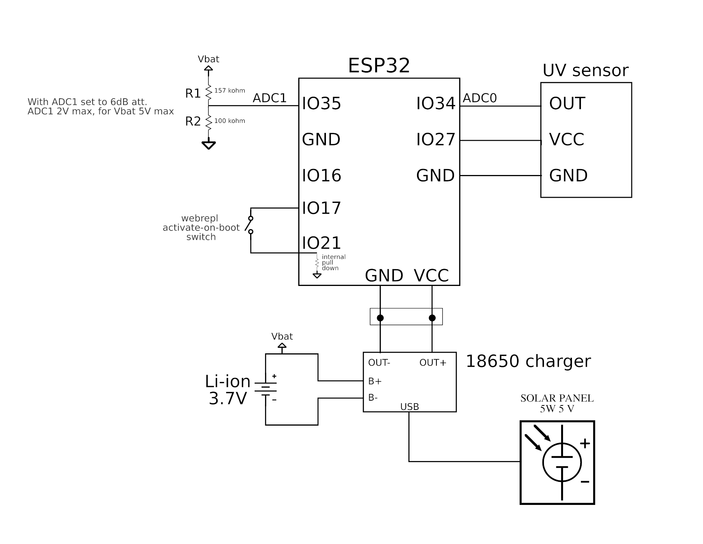
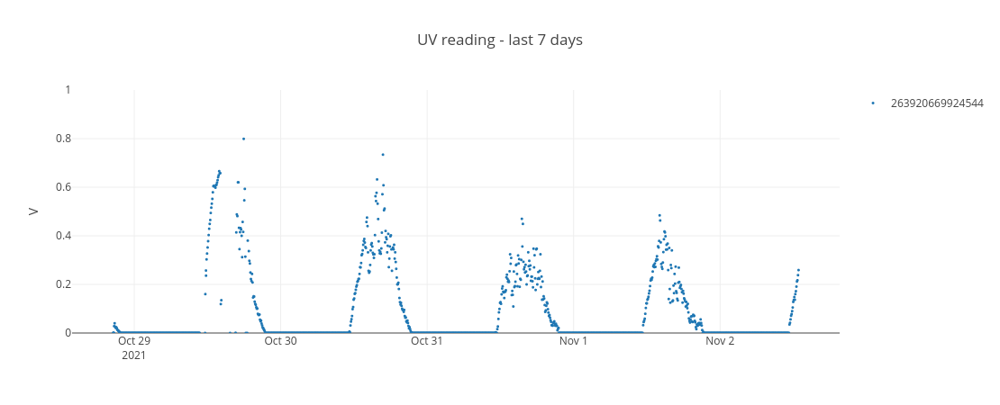

## UV measurement station
This project implements a stand-alone UV measurement station, based on an ESP32 microcontroller ([ESP32 D1 mini development board](https://www.aliexpress.com/item/4000650306925.html)) and a generic
analog [UV sensor](https://www.aliexpress.com/item/4000086056238.html) module. This station is powered by a 18650 Li-ion rechargeable battery, charged with a [small solar panel with a 5V USB output](https://www.aliexpress.com/item/1005001525456183.html). A [TP4065-based module](https://www.aliexpress.com/item/4000003923213.html) is used to control battery charge.  

Circuitry is enclosed in a low-cost glass kitchen container, providing decent water and dust tightness, and UV transparency for the sensor. Plastic containers are not recommended as they degrade under continuous exposure to UV radiation.   

### Firmware
Source code is written in Micropython. For a quick introduction to the Micropython SDK and usage examples, take a look at [this tutorial](https://github.com/bandaangosta/tutorial-wemos-esp8266). I wrote it for the ESP8266 microcontroller, but it is mostly the same concepts and instructions.

### Schematic diagram


See [docs](docs/) folder for schematics and screenshots of the materials in Aliexpress, as included links tend to disappear over time.

### Data display
UV measurements are stored in a remote InfluxDB timeseries database for live plot generation on a dedicated web application. Code for web application is not included in this repository to keep it simple. If interested, open an issue to request it.



### Battery charge monitoring

Remaining battery charge is measured using a voltage divider to keep the input voltage to the ADC within operational limits. Calibration script [config_writer.py](src/station_uv/config_writer.py) is provided to assist in the estimation of conversion parameters. To run the script, enter the interactive REPL and run:

```python
import config_writer
config_writer.create_config()
```

`config_adc.py` will be written to disk containing calibration parameters.

### Bill of materials

* [ESP32 D1 mini development board](https://www.aliexpress.com/item/4000650306925.html) 
* [Generic analog UV sensor module](https://www.aliexpress.com/item/4000086056238.html) 
* [Li-ion 3.7V charger module](https://www.aliexpress.com/item/4000003923213.html) 
* 18650 Li-ion battery (please use a known brand here. Cheap ones are a scam.) 
* Kitchen glass container 
* Resistors for voltage divider
* Cables, connectors, mounting accessories, USB cable (optional)

### Pictures

Some pictures have been included the [photos directory](docs/photos/). They are just for reference. Don't pay attention to the crude nature of the setup. This was a hasty proof-of-concept implementation, but it worked quite nicely. 
